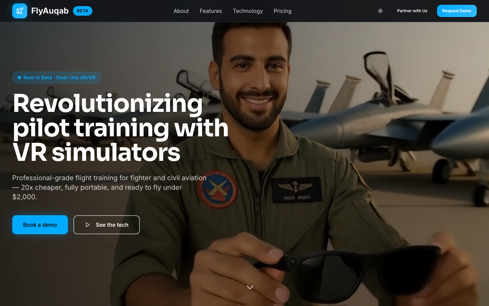
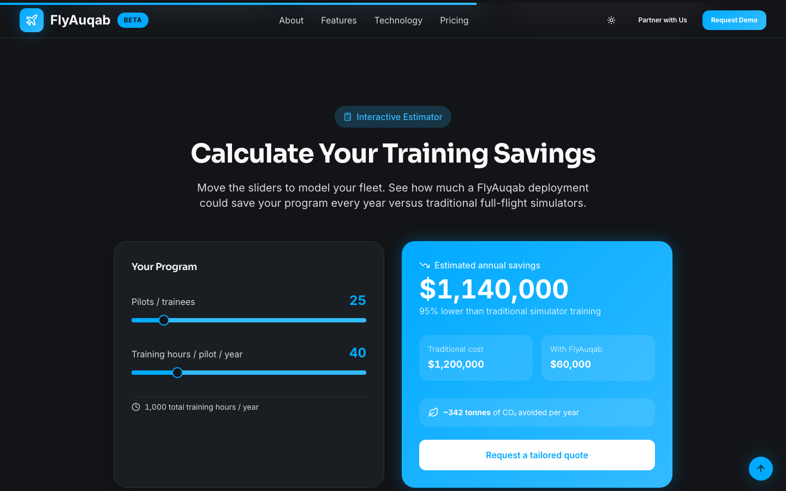
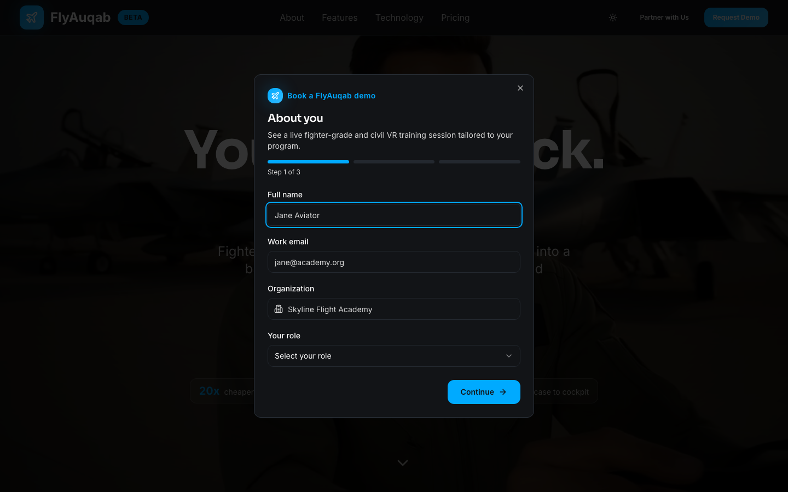
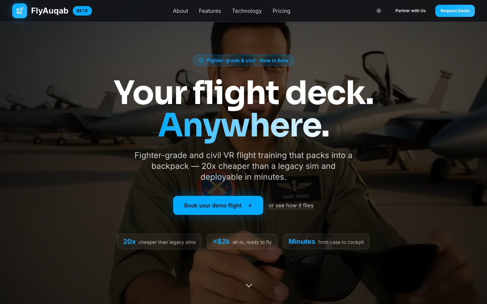
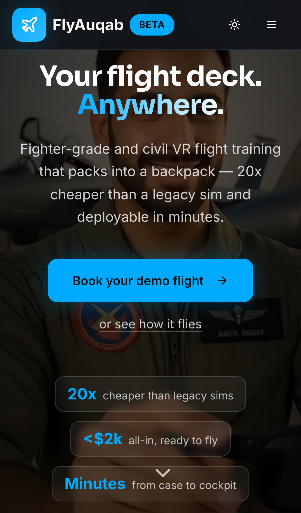

# FlyAuqab Beta — VR Flight Training, Cleared for Takeoff ✈️

<p align="center">
  
  
  
  
  
  
</p>

> Professional-grade pilot training that fits in a backpack. Fighter jets to airliners, one universal AR/VR platform — 20x cheaper, 90% fewer emissions, and ready to fly under **$2,000**.

This is the official marketing site for **FlyAuqab Beta**, a portable dual-use AR/VR flight training system. It's a fast, single-page React app engineered to feel as crisp as the cockpit it's selling — a full-bleed hero video, an interactive savings calculator, a multi-step demo-booking flow, a head-to-head comparison table, and a light/dark cabin you can switch mid-flight.

<p align="center">
  
</p>

<p align="center"><em>Real capture: full-page scroll tour, the live Training Savings Calculator, the multi-step "Book a Demo" flow, and a dark → light theme switch — no mockups.</em></p>

---

## Why it exists

Traditional full-motion simulators cost upwards of $10M and never leave the building. FlyAuqab flips that: JSBSim-grade flight dynamics, real-time weather, and physical controls in a case you can carry onto a base, into a classroom, or home for the weekend. This site tells that story and turns curious pilots and operators into booked demos — no drag, all lift.

## What's new in this release ✨

This release takes an already-slick landing page and gives it a full pre-flight upgrade — new lead-gen surfaces, a richer visual system, a hardened responsive shell, and a real test rig underneath.

- **🎫 Multi-step "Book a Demo" flow** — every *Request Demo* / *Book a demo* button across the nav, hero and closing CTA now opens a guided, multi-step lead-capture modal (contact → org → use-case) with inline validation. It tracks *where* the click came from, so marketing can see which CTA actually converts.
- **🧮 Training Savings Calculator** — an interactive section where operators dial in fleet size, sessions per month and legacy sim cost, and watch projected annual savings tick up in real time. It's the "20x cheaper" claim, made personal.
- **🅱️ A true Variant B hero** — the A/B test is no longer just a headline swap. Variant **B** renders a completely distinct centered hero (`HeroVariantB`) with trust chips and a high-intent CTA. Deep-link either cut with `?variant=a` / `?variant=b` — no console incantations required.
- **🌗 Light / dark theme toggle** — a one-tap Sun/Moon switch flips the entire aviation design system between the signature dark cockpit and a crisp daylight cabin, remembered across visits via `localStorage`.
- **🎨 Atmospheric UI polish** — a subtle animated atmosphere background, scroll-triggered reveal animations, and count-up stat bands give the page depth without weighing it down.
- **♿ Accessibility + performance pass** — skip-to-content link, semantic landmarks, visible focus rings, `prefers-reduced-motion` support, and route/section **code-splitting** so the first paint only carries the nav, hero and stats — the rest streams in on demand.
- **📱 Hardened responsive shell** — the nav locks body scroll while the mobile menu is open, closes on `Escape`, auto-collapses when you cross the desktop breakpoint, and never lets media blow out the viewport width.
- **🔎 SEO & PWA packaging** — JSON-LD structured data, Open Graph / Twitter cards, a canonical URL, `sitemap.xml`, `robots.txt`, a full favicon set and a web app manifest with maskable icons.
- **📊 Scroll-progress bar + back-to-top booster** — a glowing altimeter bar tracks your descent; a floating control rockets you back to the top once you clear the hero.
- **🧪 Real test coverage** — a Vitest + Testing Library unit/component suite, Playwright e2e smoke tests, and a GitHub Actions CI workflow that runs lint, unit tests and a production build on every push.

---

## Screenshots

| Dark cockpit (desktop) | Daylight cabin (desktop) |
| :---: | :---: |
|  |  |

| Training Savings Calculator | Book-a-Demo flow |
| :---: | :---: |
|  |  |

| Hero — Variant B | Mobile |
| :---: | :---: |
|  |  |

---

## Preflight checklist (setup) 🛫

You'll need **Node 18+** and npm. Then it's three commands from clone to cockpit:

```bash
# 1. Install dependencies
npm install

# 2. Fire up the dev server (Vite, hot-reloading)
npm run dev
# ➜ http://localhost:8080  (falls back to the next free port if 8080 is taken)

# 3. Build the production bundle
npm run build && npm run preview
```

That's it — no env vars, no API keys, no backend. It's a static SPA that deploys anywhere.

### Flight test (running the suite)

```bash
npm run test         # Vitest unit + component tests
npm run test:e2e     # Playwright end-to-end smoke tests
npm run lint         # ESLint
```

---

## A/B variants — pick your runway

The hero is a live experiment with two genuinely different cuts:

| Variant | What you get | Force it |
| :--- | :--- | :--- |
| **A** | Cinematic full-bleed video hero with left-aligned copy | `…/?variant=a` |
| **B** | Centered, trust-chip hero (`HeroVariantB`) tuned for conversions | `…/?variant=b` |

Assignment is a sticky 50/50 bucket stored in `localStorage`, so returning visitors always see the same cut for clean data. The `?variant=` query param overrides and persists the choice — perfect for QA and stakeholder previews. See [`docs/AB-VARIANTS.md`](docs/AB-VARIANTS.md) for the full playbook.

```js
localStorage.getItem("flyauqab-hero-variant"); // "A" or "B"
```

---

## Tech stack

- **Vite 5** + **React 18** + **TypeScript 5** — SWC-powered, sub-second HMR
- **Tailwind CSS 3** with a bespoke aviation design-system (HSL tokens, dual-theme)
- **shadcn/ui** + **Radix UI** primitives for accessible components
- **React Router 6**, **TanStack Query**, **React Hook Form** + **Zod**
- **Vitest** + **Testing Library** + **Playwright** for the test pyramid
- Deployed on **Cloudflare Pages** → [flyauqab.waleeds.world](https://flyauqab.waleeds.world)

## Project structure

```
src/
├── components/        # Hero (A/B), KeyStats, SavingsCalculator, DemoRequestModal, …
│   └── ui/            # shadcn/ui primitives
├── hooks/             # use-ab-variant, use-theme, use-demo-request, use-count-up
├── pages/             # Index (lazy-composed sections), NotFound
├── styles/            # ui-polish design layer
└── index.css          # design tokens + a11y/reduced-motion base layer
```

---

<p align="center"><em>Built with altitude. Cleared for takeoff at <a href="https://flyauqab.waleeds.world">flyauqab.waleeds.world</a>. ✈️</em></p>
