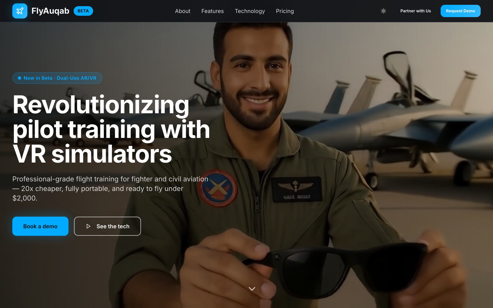
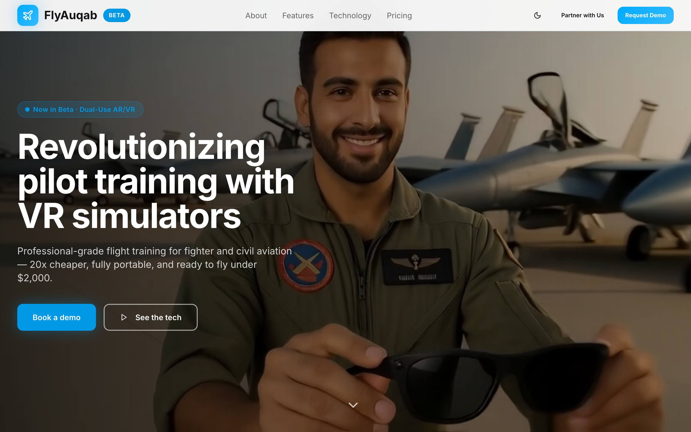
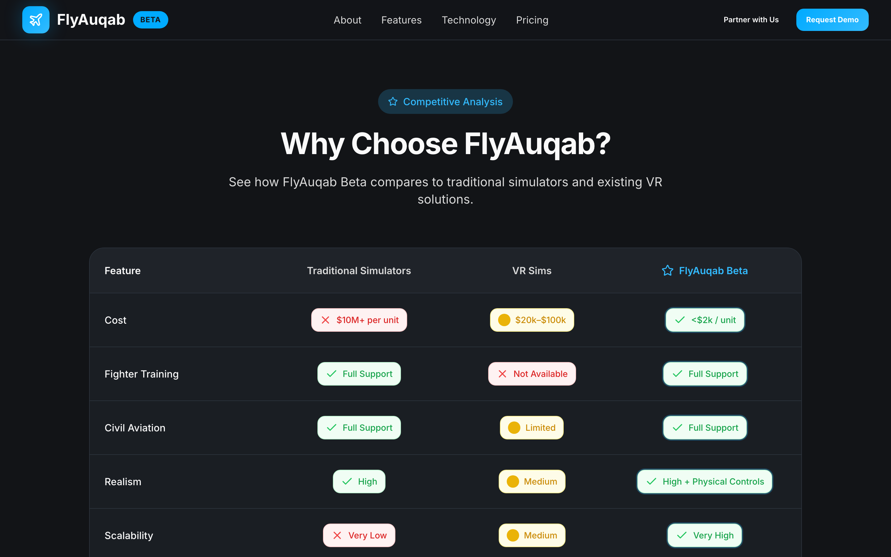
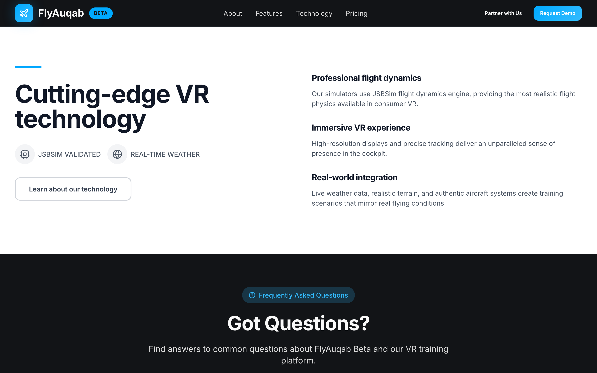
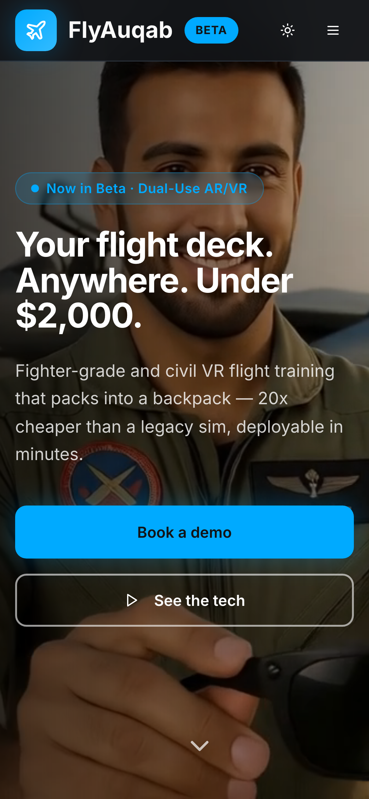

# FlyAuqab Beta — VR Flight Training, Cleared for Takeoff ✈️

> Professional-grade pilot training that fits in a backpack. Fighter jets to airliners, one universal AR/VR platform — 20x cheaper, 90% fewer emissions, and ready to fly under **$2,000**.

This is the marketing site for **FlyAuqab Beta**, a portable dual-use AR/VR flight training system. It's a fast, single-page React app built to feel as crisp as the cockpit it's selling — full-bleed hero video, a head-to-head comparison table, a tech story that lands smoothly on every screen size, and now a light/dark cabin you can switch mid-flight.

<p align="center">
  
</p>

<p align="center"><em>Real capture: full-page scroll tour, live dark → light theme switch, and the return-to-top control — no mockups.</em></p>

---

## Why it exists

Traditional full-motion simulators cost upwards of $10M and never leave the building. FlyAuqab flips that: JSBSim-grade flight dynamics, real-time weather, and physical controls in a case you can carry onto a base, into a classroom, or home for the weekend. This site tells that story and gets pilots and operators to book a demo — no drag, all lift.

## What's new in this release ✨

We took an already-slick landing page and gave it a full pre-flight upgrade:

- **🌗 Light / dark theme toggle** — a one-tap Sun/Moon switch in the nav flips the entire aviation design system between the signature dark cockpit and a crisp daylight cabin. Your choice is remembered across visits via `localStorage`, so you land where you left off.
- **🧪 A/B-tested hero headline** — every visitor is bucketed 50/50 into variant **A** (*"Revolutionizing pilot training with VR simulators"*) or variant **B** (*"Your flight deck. Anywhere. Under $2,000."*). The assignment is sticky per visitor, so the copy never flickers between reloads — clean data, happy marketers.
- **📊 Scroll-progress indicator** — a thin glowing altimeter of a bar pinned to the top edge tracks exactly how far you've descended through the page.
- **🚀 Back-to-top booster** — a floating control fades in once you clear the hero and rockets you back to the top with a smooth climb.
- **🔆 Always-readable hero** — the headline is now locked to high-contrast white so it stays legible over the video in *both* themes.

### The A/B experiment, in plain English

The hero copy is a live experiment. Open the console and check the bucket you landed in:

```js
localStorage.getItem("flyauqab-hero-variant"); // "A" or "B"
```

Want to preview the other cut? Set it and reload:

```js
localStorage.setItem("flyauqab-hero-variant", "B"); location.reload();
```

Variant A leads with the mission; variant B leads with the price. Swap freely — the rest of the flight plan stays the same.

## Feature deck

- **Cinematic hero** — autoplaying, muted, looped background video served locally (no third-party CDN, no dead links) with a poster fallback so nothing flashes on slow connections.
- **Smart, sticky navigation** — glassy backdrop-blurred nav with working smooth-scroll anchors to every section, the new theme switch, and a proper mobile hamburger menu that closes when you tap through.
- **Head-to-head comparison** — a responsive table (cards on mobile, grid on desktop) that pits FlyAuqab against traditional sims and generic VR across cost, realism, portability, and more.
- **The tech story** — JSBSim-validated dynamics, real-time weather, and real-world integration laid out in a clean two-column split.
- **Conversion-focused closers** — competitive stat cards (20x / 90% / 10x), an FAQ, and a bold closing CTA with demo + investor-deck actions.
- **Fully responsive** — from a 390px phone to a 1440px desktop, everything reflows cleanly. No horizontal scroll, no clipped headlines, no theme surprises.

## Flight deck views

| Desktop · Dark (default) | Desktop · Light |
| --- | --- |
|  |  |

| Section detail | Technology story |
| --- | --- |
|  |  |

<p align="center">
  
</p>

---

## Getting started (zero to running in five minutes)

You'll only need two things on your machine. If you've never touched a terminal, don't sweat it — copy, paste, enter, repeat.

### Prerequisites

- **[Node.js](https://nodejs.org/) 18 or newer** — the JavaScript runtime that powers the build. Grab the LTS installer, run it, done. Check it worked:
  ```bash
  node --version
  ```
- **npm** — comes bundled with Node, no separate install. Verify with `npm --version`.

### Install & run

```bash
# 1. Clone the repo
git clone https://github.com/waleedsworld/aero-cadence-labs.git
cd aero-cadence-labs

# 2. Install the dependencies (grab a coffee — it's a one-time thing)
npm install

# 3. Fire up the dev server
npm run dev
```

Vite will print a local URL (`http://localhost:8080`). Open it and you're airborne — edits hot-reload instantly.

### Build for production

```bash
# Bundle an optimized, minified build into dist/
npm run build

# Preview that production build locally before you ship it
npm run preview
```

That's the whole pre-flight checklist. Wheels up. 🛫

---

## Tech stack

Hand-built with a modern, no-nonsense front-end toolchain:

- **[Vite](https://vitejs.dev/)** — lightning-fast dev server and build tool
- **[React 18](https://react.dev/)** + **[TypeScript](https://www.typescriptlang.org/)** — typed, component-driven UI
- **[Tailwind CSS](https://tailwindcss.com/)** — utility-first styling with a custom aviation design system (HSL tokens, gradients, glow shadows, light + dark scopes)
- **[shadcn/ui](https://ui.shadcn.com/)** + **[Radix UI](https://www.radix-ui.com/)** — accessible, unstyled component primitives
- **[lucide-react](https://lucide.dev/)** — clean, consistent icons

## Project structure

```
src/
├── components/          # Page sections (Hero, Navigation, Comparison, FAQ, Footer…)
│   ├── ThemeToggle.tsx  # ☀️/🌙 light-dark switch
│   ├── ScrollProgress.tsx
│   ├── BackToTop.tsx
│   └── ui/              # shadcn/ui primitives (button, card, dialog…)
├── pages/               # Index (the landing page) and NotFound
├── hooks/               # use-theme, use-ab-variant, use-mobile, use-toast
├── lib/                 # utility helpers
├── assets/              # imported images
└── index.css            # design tokens (dark + .light scopes) + Tailwind layers
public/                  # videos, images, favicon, robots.txt (served as-is)
docs/media/              # README GIF + framed screenshots
```

## Live demo

Now boarding at **[flyauqab.waleeds.world](https://flyauqab.waleeds.world)**. 🌍

---

Built with care for the pilots of tomorrow. **FlyAuqab — Train Smarter, Fly Further.**
